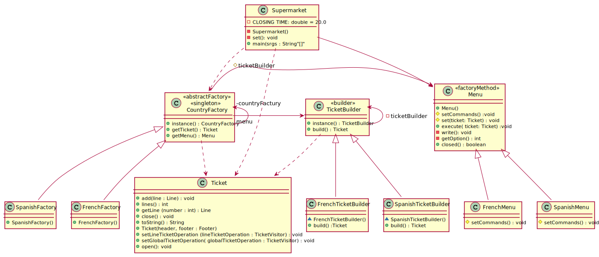

# Cadena Internacional de Supermercados
Universo Santa Tecla  
[uSantaTecla@gmail.com](mailto:uSantaTecla@gmail.com)  

Un supermercado internacional con cientos de centros repartidos por 23 países desea una gestión de tickets. 

Un ticket consta de:

* **Cabecera**: con distintos campos dependiendo del país pero siempre el nombre el nombre de la cadena y la fecha y hora 
de comienzo del ticket de compra
* **Cuerpo**:  Una secuencia de líneas que se expondrán posteriormente
* **Pie**: con distintos campos dependiendo del país pero siempre el nombre el nombre de la cadena y la fecha y hora de 
comienzo del ticket de compra

Una línea puede ser:

* De **venta**, que refleja el código, descripción, unidades y precio

* De **repetición**, que refleja otra línea exactamente igual a la dada por el número de la secuencia de líneas

* De **anulación**, que refleja el número de línea anterior anulada con un saldo negativo igual a la línea que anula

* De **devolución**, que refleja el código

* …

* *Dependiendo del país* existirán unos tipos de líneas u otros aunque venta, repetición y anulación estás presentes en 
todos. Y, por ejemplo, en España existen devoluciones pero en Francia no.

Existen dos tipos de operaciones a realizar:

* **Operación a nivel de línea** que se realiza con cada parte del ticket según se introduce en el sistema. Por ejemplo, calcular 
precio, visualizar, imprimir, descuentos por línea, …

* **Operación a nivel de ticket** que se realiza con todas las partes del ticket según se cierra. Por ejemplo, descuentos 
globales, precio global, modificación del almacén, …

* *Considerando el país*, se realizarán unas operaciones u otras. Por ejemplo, en España es legal mostrar la venta con un 
pequeño display monocromo y en Francia exigen una pantalla gráfica de 12’’ mínimo; en España no hay descuentos globales y en Francia no hay descuentos por línea; …

**Problema**. No se desea que *Supermarket* se complique con cada uno de los menús y tickets de cada país. 

* Programar para la interfaz, no para la implementación: *Abstract Factory*

**Intención**. Provee una interfaz para crear familias de objetos 
relacionados o dependientes sin especificar sus clases 
concretas

**Interrelación**. Singleton, Factory Method y Prototype

**Propósito**. 

* ~Abstract Factory vs Builder~. No se trata de una creación compleja
 …
* ~Abstract Factory vs Facade~. No se trata de ocultar un subsistema 
 …

**Rediseño**. Creando un objeto especificando una clase explícitamente (*SpanishMenu y FrenchMenu*)

**Variación**. Familias de objetos “producto” (derivadas de *Menu*)

**Problema**. No se desea complicar los algoritmos del Menú con la particularidad de cada país. 

* Determinando la granularidad de los objetos : **Command**

**Intención**. Encapsula un petición como un objeto, permitiendo de ese modo parametrizar clientes con 
diferentes peticiones, colas o solicitudes registradas, y apoyar las operaciones de deshacer.

**Interrelación**. *Prototye, ~Memento y Composite~*

**Propósito**. 

* *~Command vs Memento.~* No se trata de recuperar estados anteriores …

